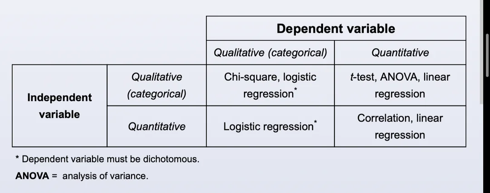
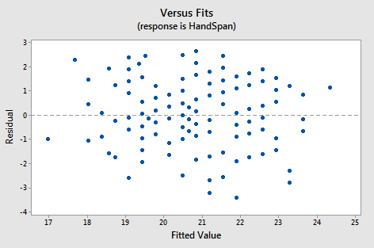
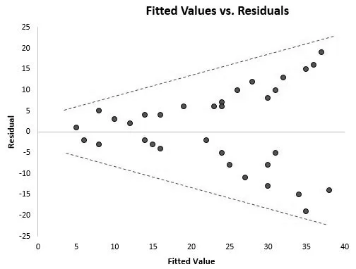
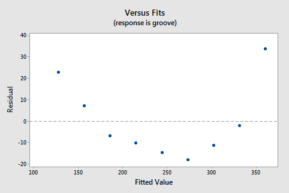

Notes about R
<- and = mean the same thing

Access columns of dataframes using $ e.g. People$MS1

each distribution has 4 corresponding function p,q,r,d

p - cdf (sum/area of probabilities up to a point)

q - get value from quantile

r - random generator based on distribution

d - pdf (density)

e.g. pnorm, qnorm, rbinom, etc

This will make more sense later.

# Hypothesis Testing

## Intro + Example

Components of a statistical test

1. Define null and alternative hypothesis

2. Calculate test statistic (e.g. t statistic, chi squared statistic)

3. Decide if we should reject null hypothesis based on test statistic (p value in our case)
  
Example: Your friend bets you $100 they can flip 10 heads in a row. To your surprise they do, how do we prove that they're a fraud?

Hypotheses: $H_0:$ $p=.5$, $H_A$ $p> .5$. p is the probability of getting heads, meaning our null hypothesis is that the coin is fair, while our alternate hypothesis is that it is biased to heads.

In this case let's calculate the chance of our friend flipping 10 heads in a row assuming the null hypothesis is true.
```{r}
(.5)^10
```
Assuming we had a p-value of .05, we would reject the null hypothesis, proving our friend is a fraud.

Where was the test statistic? Why did we compare that probability to the p-value? What is a p-value?

- **Test Statistic** In this case 10 was our test statistic, a test statistic is just a number we use to calculate the p-value based on our null-hypothesis distribution.

- **Probability** In hypothesis testing we ask, how likely is it that our test statistic can occur if we assume the null hypothesis is true. If the null hypothesis was true, the coin would behave in a way described by a **binomial distribution**. A binomial distribution shows the chance of $x$ number of heads happening given $n$ flips where each flip comes up heads with probability $p$. A **probability distribution** describes the chance of different outcomes occurring.

```{r}
n=10
P=.5
data <- dbinom(x=0:n,size=n, prob=P)
names(data) <- 0:n
cols <- rep("grey", n + 1)
barplot(data, col = cols)
```

- **P-Value** The p-value is the chance of seeing our test statistic or something as extreme given the null hypothesis is true. What does this mean? If our friend only flipped 8 heads this means we would sum the probabilities of flipping 8, 9, and 10 i.e. $p(x\geq 8)$.

```{r}
print(pbinom(10-1, size=n, prob=P, lower.tail=FALSE))
print(pbinom(8-1, size=n, prob=P, lower.tail=FALSE))
```
Visually
```{r}
n=10
P=.5
data <- dbinom(x=0:n,size=n, prob=P)
names(data) <- 0:n
cols <- rep("grey", n+1)
cols[seq(n-1,n+1)] <- "red"
barplot(data, col = cols)
```

If they had flipped 8 heads (any order), we would have to accept the null hypothesis as our p-value was only .05.

## More Tests
Different tests have different distributions associated with them (t distribution for t test, normal distribution for z test, etc)

How do you decide what test to use? Look at what you are measuring and the assumptions of the test

-**chi-squared** - compares categorical data from two groups, looking at if their percentages or proportions are different

-**t-test/z-test** - compares numeric data between two groups, looking at if the means are different. It assumes the data is normally distributed, differing SD/SE assumptions. .

-**ANOVA** - Compare 3 or more groups of numerical data/means, while previously mentioned tests compare two groups.

```{r echo=FALSE, fig.cap="Uworld Entry ", out.width = '75%'}

```

Rule of thumb t-test for n<30, z-test otherwise

Why?

z test includes the assumption that population variance is known, t test does not. The t distribution looks like a stretched out normal distribution. It was designed this way as we are approximating the population variance, so the distribution is less narrow to factor in this uncertainty. For larger sample sizes, the t distribution looks closer to the normal distribution, n=30 is an arbitrary cut off for closeness between the two.

```{r}
x = seq(-3, 3, length=1000)
hx = dnorm(x)

degf = c(1, 2, 5, 10)
colors = c("red", "blue", "green", "gold", "black")
labels = c("df=1", "df=2", "df=5", "df=10", "normal")
{plot(x, hx, type="l", lty=1, xlab="x value",ylab="Density", main="Comparison of t Distributions")

#The relevant modification
mapply(function(DoF, W, C) lines(x, dt(x, DoF), lwd=W, col=C), DoF = degf, W = c(3,1,1,1), C= colors[-5])

legend("topleft", inset=.05, title="Distributions",labels, lwd=1, lty=c(1, 1, 1, 1, 1), col=colors)}
```

## T-Test Example

What we do here: Define problem + check data for assumptions + run test

IRL people use *non-parametric* version of t-test, Wilcoxon test, you don't have to worry about normal assumption, but boards may ask you about t-test, anova, chi square 😈.

A pharmaceutical company develops a new ACE inhibitor that they say lowers systolic blood pressure by 20 mmHg, how do we test this?

Hypotheses: $H_0:$ means differ by 20, $H_A:$ means don't differ by 20

```{r}
# Randomly Generated Data for test
systolic_data<-data.frame(Before = rnorm(40, mean=130, sd=6),
           After = rnorm(40,mean=120,sd=5))
head(systolic_data)
```

Since we are using before/after data, there is some correlation between the groups, so we use a paired t-test. If we were comparing two independent groups we would use a 2 sample t test.

# Check Assumptions

In inference (draw conclusions from your data), assumptions are important in understanding if the significant p-value even means anything. As opposed to prediction (extrapolation), where we care how accurate the model is on our test set/in practice and usually ignore assumptions.

```{r}
# Check Assumptions
hist(systolic_data$Before)
# Visually inspect if graph resembles a normal distribution in any way, do the same for systolic_data$After
```
```{r}
# Check Assumptions
print(bartlett.test(systolic_data))
# Null hypothesis that variances are the same
```

## Optional

qqplot, if the dots are on the line, it's probably normal
```{r}
# Check Assumptions
#{qqnorm(systolic_data$Before, pch = 1, frame = FALSE)
#qqline(systolic_data$Before, col = "steelblue", lwd = 2)}
```

Statistical test to compare your data to normal, if p-value is high your data is normal (null hypothesis = data is normal in this test)
```{r}
# Check Assumptions
#shapiro.test(systolic_data$Before)
```

## T-Test
```{r}
t.test(x=systolic_data$Before,
        y=systolic_data$After,
       alternative = "two.sided",
       mu = 20, 
       paired = TRUE,   
       var.equal = TRUE,
       conf.level = 0.95)
```

We reject the null hypothesis that the difference was 20, the drug company's claim may be false.

Try changing mu to 10, p value not significant so we accept the null hypothesis. That doesn't mean the null hypothesis is true, just that we don't have evidence to refute it.

# Chi-Square
Non-parametric test to compare categorical/count data

Hypotheses: $H_0:$ handedness and exercise are independent, $H_A:$ handedness and exercise habits are related

```{r}
library(MASS)

#stu_data = data.frame(survey$W.Hnd,survey$Exer) <- raw data
stu_data = table(survey$W.Hnd,survey$Exer) # this organizes it into count data for chi-square
print(stu_data)
```

```{r}
print(chisq.test(stu_data))
```
No evidence to say handedness and exercise affect each other

# ANOVA

ANOVA with two variables = t-test.

Hypotheses: $H_0:$ means of all groups are equal, $H_A:$ one of the groups differs

# Regression

```{r pressure, echo=FALSE, fig.cap="A caption", out.width = '75%'}
knitr::include_graphics("Media/regress.png")
```

Linear Regression: $y = \beta_0+\beta_1x_1+\beta_2x_2+...+\beta_nx_n$

$x_i$ is a predictor variable

$y$ is the outcome you are predicting

Logistic Regression $P = \frac{e^{\beta_0+\beta_1x_1+\beta_2x_2+...+\beta_nx_n}}{1+e^{\beta_0+\beta_1x_1+\beta_2x_2+...+\beta_nx_n}}$

$P$ - this is the probability, takes a value between 0 and 1.

$x_i$ are again predictor variables

Regressions can be used for inference and prediction. It is used for inference because a t-test is performed on each variable's coefficient, comparing it to 0, to see if it significantly impacts our output. It's used for prediction because we can feed it data outside of our dataset and get an output.

# Logistic Regression Example: Heart Disease
https://www.kaggle.com/datasets/fedesoriano/heart-failure-prediction
We give an example of logistic regression here, the principles are the same as linear regression. We want to know if we can use the data to predict whether a patient will have some heart disease.

```{r}
data<-read.csv('Data/heart.csv')
data$HeartDisease<-factor(data$HeartDisease,levels=c(0,1), labels=c("No", "Yes"))
```

```{r}
#install.packages('caret')
library(caret)
```
```{r}
strnumdata<-as.data.frame(model.matrix(HeartDisease~.,data=data))
strnumdata<-cbind(strnumdata,data$HeartDisease)
colnames(strnumdata)[17]<-"HeartDisease"
```

```{r}
model <- train(HeartDisease~.,
  data = strnumdata,
  method = "glm",
  family=binomial())
```

```{r}
summary(model)
```
AIC measures goodness of fit while discounting for more variables (penalize overfitting), lower is better.

The Estimate column is what it approximates the coefficient for each variable as, what does it mean if something is positive or negative?

When the variable is increased by 1 unit, the output variable changes by one unit. E.g. a 1 year increase in age corresponds to a 0.016550 log odd increase in heart disease. (in linear regression the interpretation is easier as it's an increase in your predictor variable units rather than log odds like logistic regression)

What is the pr column telling us? Essentially, a one sample t-test is performed with each coefficient with the null hypothesis that the coefficient is equal to zero (doesn't actually contribute to our model). What do we do with this information? Depends on your goals and domain expertise. It looks like cholesterol is a significant predictor, but the coefficient is estimated to be negative. Negative correlation between cholesterol and heart disease doesn't really make sense, the data itself might not be great here...

In a linear regression, there will also be an $R^2$ value which describes the amount of variance in the dependent variable explained in the predictors, takes a value from 0-1, higher is better.

## Prediction - Cross Validation

In prediction, you can evaluate your model by training it on a subset of your data and testing it on some data that you hold out. This can help identify model overfitting (if it fits well/has high accuracy on the data you trained it on but not your test data there may be overfitting) and give you a better accuracy measure.

When splitting the data, you may by chance create a test set with lots of unusual data, to avoid this people typically use cross validation, where you split your data in multiple ways, then train and test on each of those. Here is how you would do that in R.

```{r}
train_control <- trainControl(method = "cv", number = 10,
  savePredictions = TRUE, classProbs = TRUE,)

model <- train(HeartDisease~.,
  data = strnumdata,
  trControl = train_control,
  method = "glm",
  family=binomial())

model$resample
model$results
```

## Optional ROC Curve
This is specific to classification model like logistic regression
https://developers.google.com/machine-learning/crash-course/classification/roc-and-auc
```{r}
#library(MLeval)
#x<-evalm(model)
```

# Go Further

## Residuals

Plotting the errors (residuals) against the predicted value in linear regression can help you uncover if your data breaks the assumption of the model, and tells you a bit about how you should model your data. If the residual looks pretty random and spread out, it indicates the residuals have the same variance and that a linear model works well here.

```{r echo=FALSE, fig.cap="Good Residual", out.width = '75%'}

```

```{r echo=FALSE, fig.cap="Heteroscedastic", out.width = '75%'}

```

```{r echo=FALSE, fig.cap="Nonlinear", out.width = '75%'}

```

https://online.stat.psu.edu/stat462/node/120/ (can also check out lessons 4.3 and 4.4 in table of contents in this link)

## Data Exploration
We did not cover exploratory data analysis on our kaggle data, an example of doing this can be seen here: 

https://www.kaggle.com/code/durgancegaur/a-guide-to-any-classification-problem - python (description might be better than R page)
https://www.kaggle.com/code/burakdilber/heart-failure-eda-preprocessing-and-10-models - R

## Extra Regression Terms
You can include interaction terms, or power terms in your regression. I.e. take two predictor variables and multiply them together or take one of your predictors and square all of its data.

https://developer.nvidia.com/blog/a-comprehensive-guide-to-interaction-terms-in-linear-regression/

## Regression Regularization
For prediction, you can include a regularization term to prevent overfitting, e.g. ridge or lasso regression. In lasso regression, some of the coefficients may become zero so it's a form of feature selection in this sense. These are also equivalent to bayesian regression with certain priors

https://www.youtube.com/watch?v=Xm2C_gTAl8c

https://stats.stackexchange.com/questions/93181/ridge-lasso-and-elastic-net
